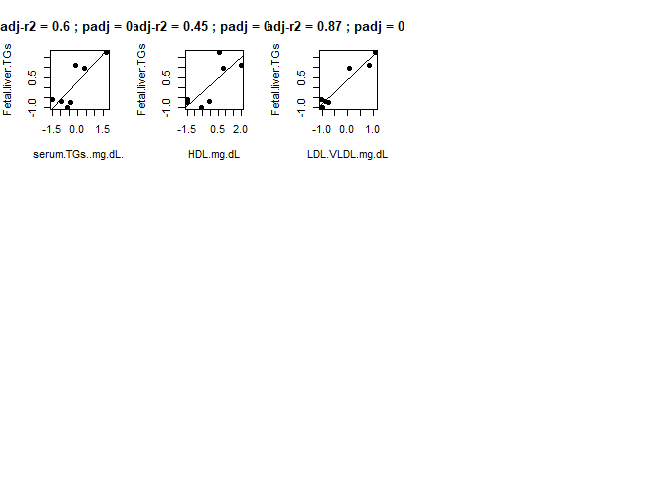

# More-Microbiome-Analysis-Methods

This code is a collection of all the code produced during my postdoc. We
will cover repeated measures regression with the lmer package, basic
regression model selection criteria using AICc, PCoA model selection
criteria using AICc, and variable selection using LASSO regression.

## Things you’ll need

-   Base R: <https://www.r-project.org/>
-   R Studio: <https://rstudio.com/products/rstudio/download/>
-   Dataset

# 1) Introduction

-   This code is just a compilation of all the code I’ve produced during
    my postdoc. It will not include a primer on how to use R or any of
    the code for looking at alpha diversity, beta diversity, negative
    bionomial regressions, or anything covered in the first workshop
    (V1.3).

-   The code used will also likely be very messy and not converted to
    functions, making them bulky to use (since they aren’t being held in
    a package); might go back and improve this later, but who knows!

-   The data used here will span two to three papers as the methods used
    were different between each. If I get around to writing it, we’ll
    discuss pros and cons of each method later (sorry)

-   More information on the metagenomics or sequence processing
    techniques can be found in the reference paper (PMID: 35966074) and
    in the companion folder

# 2) Installing R Packages

-   Anyway, let’s start by installing the packages you’ll need for this.

``` r
install.packages("vegan")
install.packages("tidyverse")
install.packages("tidyr")
install.packages("MASS")
install.packages("car")
install.packages("FSA")
install.packages("ggplot2")
install.packages("lme4")
install.packages("FSA")
install.packages("MuMIn")
install.packages("glmnet")
```

-   Packages are written by members of the R community, so some caution
    should be used when trying out random packages with little/no
    documentation.
    -   You can find the documentation for any package in R (in this
        case the vegan package) like so:

``` r
help(package=vegan)
```

-   More documentation, tutorials, and other tips/tricks/solves can be
    found on via search engine (usually)
-   Let’s load these packages into R and get started

``` r
require("vegan")
require("tidyverse")
require("tidyr")
require("MASS")
require("car")
require("FSA")
require("ggplot2")
require("lme4")
require("FSA")
require("MuMIn")
require("glmnet")
```

-   This data is from the CHOICE study conducted at CU. Briefly, women
    with GDM were fed either a CHOICE diet (60% complex carbohydrate/25%
    fat/15% protein, n=18) or a conventional diet (CONV, 40% complex
    carbohydrate/45% fat/15% protein, n=16) from 30 weeks’ gestation
    through delivery.

-   We will be looking at the infant stool samples collected at 2 weeks,
    2 months, and 4-5 months of age and their association with diet
    group, gestational weight gain, delivery mode (CS/vaginal),
    breastfeeding status (exclusive BF, mixed, formula), and sex
    (male/female).

-   Here, we will look at longitudinal analyses for alpha, and beta. I
    also did a taxa comparison using AIC to narrow down my models, but I
    have a better method of doing this that we will go over later

-   The paper on this data can be found here
    <https://pubmed.ncbi.nlm.nih.gov/35966074/>

-   Let’s get to reading our data in.

``` r
fam<-read.csv("inf_MB_fam_paired_noabx.csv",header=T,fill=T)
cho_meta<-read.csv("inf_meta_paired_noabx.csv",header=T,fill=T)
cho_meta.e<-cho_meta[,-c(1:4)] #we're removing metadata values we don't need (participant ID, timepoint, group, etc.) leaving us with continuous variables from maternal plasma measurements
```

-   I said I wouldn’t be doing alpha/beta diversity here (I lied!), but
    since I did a longitudinal analysis of the data that wasn’t in the
    previous workshop code I’ll run through the setup quickly
-   Start with calculating chao and shannon diversity; there are many
    other types of alpha diversity measures (many can be calculated by
    vegan) but they generally tell you the same thing about richness or
    overall diversity of the ecosystem

``` r
fam$PTID<-as.factor(fam$PTID)
shan<-diversity(fam[,-c(1:4)],index="shannon")
chao<-estimateR(round(fam[,-c(1:4)])) #Chao outputs a bunch of numbers, so   you gotta pull out the single Chao1 score of interest, like so
chao<-chao[2,]
```

-   Basically we just send the data through a for loop that creates
    several models and compares which is the best fit of the data.
-   Each model is set up such that alpha diversity is the response
    variable and the independent variables are the measurements + the
    interaction between diet group and timepoint + an error term for
    tracking participants over time (this last part is what makes it a
    repeated measures analysis)

``` r
#Alpha repeated measures
m<-data.frame(c("meta","aicc"))
for(i in 1:ncol(cho_meta.e)){
  a<-cho_meta.e[,i] #iterate over cho_meta.e one column at a time
  m1 <- lmer(shan~a+fam$Group*fam$time+(1|fam$PTID)) #then run a linear mixed-effects model for each column variable (a) accounting for diet group, timepoint, the interaction of diet*time, and using the error term (1|fam$PTID) to correct for the longitudinal collection
  temp<-AICc(m1)
  m[i,1]<-colnames(cho_meta.e[i])
  m[i,2]<-temp
}
```

-   My code above is bad (ideally it’d include all the comparisons
    needed and output both the full list of results plus the optimal
    model automatically), but for now we have to run both a simple model
    (shannon~group\*time) and a full model that includes all the
    variables at once.
    -   Strictly speaking, the simplest model is just
        lmer(shan~1+(1\|fam$PTID)), which, if it’s the best model
        according to AIC, would mean that none of the terms are
        important in describing shannon diversity; not a particularly
        useful interpretation of the data, especially when the anova
        output will tell you if the association is significant or not

``` r
m1 <- lmer(shan~fam$Group*fam$time+(1|fam$PTID)) #simple model
m2 <- lmer(shan~fam$Group*fam$time+cho_meta$GestationalWtGain+cho_meta$DeliveryType+cho_meta$BreastFeeding+(1|fam$PTID)) #full model; contains all terms
```

-   We then compare all the results and use the model with the lowest
    value (the AIC and BIC are like golf scores: lower is better)

``` r
m
```

    ##   c..meta....aicc..       V2
    ## 1 GestationalWtGain 85.55686
    ## 2      DeliveryType 80.02299
    ## 3     BreastFeeding 80.65645
    ## 4               Sex 80.73661

``` r
AICc(m1)
```

    ## [1] 76.31015

``` r
AICc(m2)
```

    ## [1] 93.42912

-   The simple model is best (AICmin = 76.31) so we go with that one for
    our stats; we’re making sure to use a type III ANOVA so that the
    order of the terms in the model does not matter. Generally, you look
    for an AICc difference of \>=2. If there are two models that are
    within 2 of each other, take the simpler model (i.e., the one with
    fewer terms), otherwise (if they are the same complexity) try a
    hybrid model that includes both the terms and see if the model
    improves; if not, use the model with the lowest value

``` r
Anova(m1,type="III")
```

    ## Analysis of Deviance Table (Type III Wald chisquare tests)
    ## 
    ## Response: shan
    ##                      Chisq Df Pr(>Chisq)    
    ## (Intercept)        87.6522  1     <2e-16 ***
    ## fam$Group           0.1872  1     0.6652    
    ## fam$time            1.4927  2     0.4741    
    ## fam$Group:fam$time  0.1061  2     0.9483    
    ## ---
    ## Signif. codes:  0 '***' 0.001 '**' 0.01 '*' 0.05 '.' 0.1 ' ' 1

-   Let’s move on to beta diversity. You can actually do a repeated
    measures PERMANOVA by treating each timepoint as a block that is
    linked via participant ID.
-   I’m using other people’s code to calculate PERMANOVA AIC, so see the
    function below

``` r
AICc.PERMANOVA2 <- function(adonis2.model) {
  
  # check to see if object is an adonis2 model...
  
  if (is.na(adonis2.model$SumOfSqs[1]))
    stop("object not output of adonis2 {vegan} ")
  
  # Ok, now extract appropriate terms from the adonis model Calculating AICc
  # using residual sum of squares (RSS or SSE) since I don't think that adonis
  # returns something I can use as a likelihood function... maximum likelihood
  # and MSE estimates are the same when distribution is gaussian See e.g.
  # https://www.jessicayung.com/mse-as-maximum-likelihood/;
  # https://towardsdatascience.com/probability-concepts-explained-maximum-likelihood-estimation-c7b4342fdbb1
  # So using RSS or MSE estimates is fine as long as the residuals are
  # Gaussian https://robjhyndman.com/hyndsight/aic/ If models have different
  # conditional likelihoods then AIC is not valid. However, comparing models
  # with different error distributions is ok (above link).
  
  
  RSS <- adonis2.model$SumOfSqs[ length(adonis2.model$SumOfSqs) - 1 ]
  MSE <- RSS / adonis2.model$Df[ length(adonis2.model$Df) - 1 ]
  
  nn <- adonis2.model$Df[ length(adonis2.model$Df) ] + 1
  
  k <- nn - adonis2.model$Df[ length(adonis2.model$Df) - 1 ]
  
  
  # AIC : 2*k + n*ln(RSS/n)
  # AICc: AIC + [2k(k+1)]/(n-k-1)
  
  # based on https://en.wikipedia.org/wiki/Akaike_information_criterion;
  # https://www.statisticshowto.datasciencecentral.com/akaikes-information-criterion/ ;
  # https://www.researchgate.net/post/What_is_the_AIC_formula;
  # http://avesbiodiv.mncn.csic.es/estadistica/ejemploaic.pdf;
  # https://medium.com/better-programming/data-science-modeling-how-to-use-linear-regression-with-python-fdf6ca5481be 
  
  # AIC.g is generalized version of AIC = 2k + n [Ln( 2(pi) RSS/n ) + 1]
  # AIC.pi = k + n [Ln( 2(pi) RSS/(n-k) ) +1],
  
  AIC <- 2*k + nn*log(RSS/nn)
  AIC.g <- 2*k + nn * (1 + log( 2 * pi * RSS / nn))
  AIC.MSE <- 2*k + nn * log(MSE)
  AIC.pi <- k + nn*(1 + log( 2*pi*RSS/(nn-k) )   )
  AICc <- AIC + (2*k*(k + 1))/(nn - k - 1)
  AICc.MSE <- AIC.MSE + (2*k*(k + 1))/(nn - k - 1)
  AICc.pi <- AIC.pi + (2*k*(k + 1))/(nn - k - 1)
  
  output <- list("AIC" = AIC, "AICc" = AICc, "AIC.g" = AIC.g, 
                 "AIC.MSE" = AIC.MSE, "AICc.MSE" = AICc.MSE,
                 "AIC.pi" = AIC.pi, "AICc.pi" = AICc.pi, "k" = k, "N" = nn)
  
  return(output)   
  
}


#bray
n<-data.frame(c("meta","aicc"))
dat<-cho_meta.e
for(i in 1:ncol(dat)){
  a1<-dat[,i]
  df<-vegdist(fam[,-c(1:4)],method="bray")
  perm <- how(nperm = 999)
  setBlocks(perm) <- with(fam, PTID)
  temp<-adonis2(df~a1+fam$Group*fam$time,permutations=perm)
  aic<-AICc.PERMANOVA2(temp)
  n[i,1]<-colnames(dat[i])
  n[i,2]<-aic$AICc
}
```

-   Per usual, my code is scuffed, so you need to run the simple and
    full models separately.

``` r
dist<-vegdist(fam[,-c(1:4)],method="bray")

m1<-adonis2(dist~fam$Group*fam$time,permutations=perm)
AICc.PERMANOVA2(m1)
```

    ## $AIC
    ## [1] -88.95361
    ## 
    ## $AICc
    ## [1] -87.45361
    ## 
    ## $AIC.g
    ## [1] 89.83264
    ## 
    ## $AIC.MSE
    ## [1] -82.64836
    ## 
    ## $AICc.MSE
    ## [1] -81.14836
    ## 
    ## $AIC.pi
    ## [1] 90.1379
    ## 
    ## $AICc.pi
    ## [1] 91.6379
    ## 
    ## $k
    ## [1] 6
    ## 
    ## $N
    ## [1] 63

``` r
m2<-adonis2(dist~fam$Group*fam$time+cho_meta$GestationalWtGain+cho_meta$DeliveryType+cho_meta$BreastFeeding,permutations=perm)
AICc.PERMANOVA2(m2)
```

    ## $AIC
    ## [1] -86.51376
    ## 
    ## $AICc
    ## [1] -82.28299
    ## 
    ## $AIC.g
    ## [1] 92.27249
    ## 
    ## $AIC.MSE
    ## [1] -75.62467
    ## 
    ## $AICc.MSE
    ## [1] -71.3939
    ## 
    ## $AIC.pi
    ## [1] 93.16159
    ## 
    ## $AICc.pi
    ## [1] 97.39236
    ## 
    ## $k
    ## [1] 10
    ## 
    ## $N
    ## [1] 63

``` r
m1
```

    ## Permutation test for adonis under reduced model
    ## Terms added sequentially (first to last)
    ## Blocks:  with(fam, PTID) 
    ## Permutation: free
    ## Number of permutations: 999
    ## 
    ## adonis2(formula = dist ~ fam$Group * fam$time, permutations = perm)
    ##                    Df SumOfSqs      R2      F Pr(>F)  
    ## fam$Group           1   0.1341 0.00964 0.6025  0.052 .
    ## fam$time            2   0.5376 0.03866 1.2076  0.138  
    ## fam$Group:fam$time  2   0.5466 0.03930 1.2277  0.075 .
    ## Residual           57  12.6885 0.91239                
    ## Total              62  13.9069 1.00000                
    ## ---
    ## Signif. codes:  0 '***' 0.001 '**' 0.01 '*' 0.05 '.' 0.1 ' ' 1

-   The numbers are negative, but (as I’ve read online) this isn’t an
    issue–you still pick the lowest value (i.e., most negative number in
    this case), which is the simple model again (AICc = -87.45)

-   Now, I’m going to skip the taxa comparisons because it’s a truly
    horrible way to do those via AICc in a negative binomial framework
    (I don’t wanna talk about it). Instead, I’m going to show how to
    perform variable selection using LASSO regularization using another
    dataset

-   This dataset is a collection from non-human primates exposed to
    WD-induced maternal metabolic and microbiome changes in the absence
    of obesity, and miRNA and gene expression changes in the placenta
    and fetal liver after ~8-11 months of WD challenge.

-   We will first perform variable selection between moms and their
    infants using the measured miRNA, protein, and some other measures
    taken

-   Note that we are scaling the data around the mean/SD, but you can
    transform your data however is needed and run this the same way

``` r
dat<-read.csv("baboon_data_no_outliers.csv")

#for lasso regression, need complete data. set up the data frames into discreet "blocks" of data that can be analyzed as complete sets (without removing every baboon with 1 NA value...)
dat.mom<-dat[,c(5:12,15:17)]
dat.inf<-dat[,c(19:ncol(dat))]
#testing w/o proteins in analysis
dat.inf<-dat.inf[,c(1:63)]

diet<-dat$Diet

dat.inf.scale<-data.frame(scale(dat.inf,center = T,scale = T))
dat.mom.scale<-data.frame(scale(dat.mom,center = T,scale = T))

dat.inf.mir<-dat.inf.scale[,c(4:36)]
dat.inf.protein<-dat.inf.scale[,c(37:ncol(dat.inf))]
dat.inf.other<-dat.inf.scale[,c(1:3)]
```

-   Now that we have the data organized, let’s start running our models.

-   It’s important to note that the data have to be complete (i.e., no
    missing values), so in this case the LASSO trained models can only
    be done on a subset of the data. The resulting output can be run of
    the full dataset, after the optimal variables are selected; the
    output of summary(var.n) tells us what the minimal number of samples
    is for creating these models

-   Note that you can include an interaction term for all models,
    meaning you can look for diet or sex interactions within your
    variables. However, I won’t be going over that here, and I think
    some downstream code would have to be re-written (currently it works
    by referencing the variable names to the data column names, so an
    interaction term of variable1\*diet would not be found as an exact
    match; a fix for this (again, in the code downstream; adding an
    interaction term here should work) is to find any cases with an
    asterisk, pulling onle the variable name, and then adding back the
    interaction term with paste(), setting the formula with as.formula,
    or similar method).

    -   On the most basic level, you would specify interactions in the
        model as “f \<- as.formula(y ~ .\*diet)“; you can try it here
        with sex if you like

``` r
#mom v inf body comp parameters
var.n<-data.frame()
collect<-data.frame()
a<-dat.inf.other
b<-dat.mom.scale
for(i in 1:ncol(a)){
  dat.i.c<-a[,i]
  temp<-data.frame(dat.i.c,b)
  temp.c<-temp[complete.cases(temp),]
  vars<-data.frame(temp.c[,-1])
  var.n[i,1]<-nrow(vars)
  
  ##Setting up models
  f <- as.formula(y ~ .)
  y <- temp.c$dat.i.c
  # Second step: using model.matrix to take advantage of f
  x <- model.matrix(f, vars)[, -1]
  
  #find best lambda
  cv_model <- cv.glmnet(x, y, alpha = 1, nfolds=50)
  best_lambda <- cv_model$lambda.min
  
  bm<-glmnet(x, y,alpha=1,lambda = best_lambda,standardize = F)
  print(bm)
  coef(bm)
  test<-coef(bm)
  test2<-data.frame(test@Dimnames[1],as.matrix(test))
  test3<-test2[-1,]
  sig<-test3[test3$s0!=0,]
  if(nrow(sig)>0){
    col.b<-data.frame(rep(colnames(a[i]),nrow(sig)),sig)
    collect<-rbind(collect,col.b)
  }
}
summary(var.n$V1)
```

-   Now we need to pull the significant associations and run the
    univariate stats on them with an anova
-   Keep in mind that we are using the transformed data for these
    analyses; you may want to use the untransformed data for plotting
    (helps with ease of interpretation sometimes), but play around with
    the presentation
-   There’s probably a better way of doing this, but this is how I did
    it:

``` r
#keep vars that have sig terms
overall<-data.frame()
for(i in 1:nrow(collect)){
  
  y<-a[,colnames(a)%in%collect[i,1]]
  vars<-b[,colnames(b)%in%collect[i,2]]
  
  m<-summary(aov(y~vars))
  rsq<-summary(lm(y~vars))
  r<-rsq$adj.r.squared
  c<-cor.test(y,vars)
  
  #change to 1
  p<-m[[1]][["Pr(>F)"]][1]
  
  model<-data.frame(collect[i,1],collect[i,2],r,c$estimate,p)
  colnames(model)<-c("measure","gene","r2","correlation","p-value")
  
  overall<-rbind(overall,model)
}

p.adj<-p.adjust(overall$`p-value`,method="BH")

overall.final<-cbind(overall,p.adj)
```

-   The variable “overall.final” is what we’re looking for. In order,
    the layout tells us which variable is our y, our x, and stats for
    r-squared, correlation coefficient (spearman is the default, I
    believe), unadjusted p value, and Benjamini-Hochberg adjusted p
    value

    -   I have both r-squared and correlation in here to represent the
        strength of association in the regression (r-squared) and the
        direction of association (positive vs negative
        correlation)–useful info to have if you want to make a table of
        the data rather than show plots

-   I like seeing the data associations, so let’s plot the results.
    Easier if you export as a tiff file and check the output there, but
    we’ll look at the output here

-   Note that this plotting code is really bad since it relies on a
    hard-coded “if” block to correctly read in the variables that it
    should be plotting from the overall.final-formatted results (though
    this version should be way better than previous versions). But it
    works!

``` r
#######
#plot sig terms
par(mfrow=c(3,5),mar=c(4,4,4,2))
sig<-overall.final[overall.final$`p-value`<0.1,]

for(i in 1:nrow(sig)){
  if(sig[i,2] %in% colnames(b)){

    dat.i.c<-a[,which(colnames(a)==sig[i,1])]
    temp<-data.frame(dat.i.c,b)
    temp.c<-temp[complete.cases(temp),]
    vars<-data.frame(temp.c[,-1])
    var.n<-sig[i,1]
    
    y<-temp.c$dat.i.c
    x<-unlist(temp.c[,which(colnames(temp.c)==sig[i,2])])
    plot(y~x,pch=16,col=1,main=paste0("adj-r2 = ",round(as.numeric(sig$r2[i]),2)," ; ","padj = ",round(as.numeric(sig$p.adj[i]),3)),xlab=paste(sig[i,2]),ylab=paste(var.n))
    abline(lm(y~x))    
  }
}
```



-   One other thing I have done is center-log transform the microbiome
    data before analysis to normalize the count data using the R package
    compositions
-   Note that you’ll want to do the clr transform on the relative
    abundance data (so participant microbiota should sum to 1) and make
    sure to add a pseudocount of 1 since clr contains a log-transform
    step and you don’t want your 0’s going to infinity

``` r
require(compositions)
otu.clr<-data.frame(clr(ra+(1)))
```
